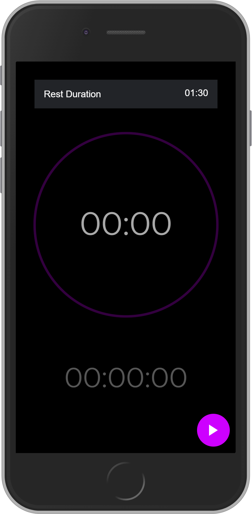

# Ionic Timer Stopwatch ⌚

## Demo
<p align="center">
      
      
</p>

## Setup

Requirements to use this project:

- [Node.js](https://nodejs.org/download/)

- [Ionic CLI](https://ionicframework.com/docs/intro/cli)

Install the Ionic CLI with npm:
```sh
$ npm install -g @ionic/cli
```

## Install NPM Dependencies
Once you clone this repository, run this command on your terminal to install all needed dependencies:
```sh
$ npm install
```


## Launching the App
After installing the needed dependencies you are done, launch your app with a simple
```sh
$ ionic serve
```
 
## Ionic Info
```
Ionic:

   Ionic CLI                     : 6.11.8
   Ionic Framework               : @ionic/angular 5.3.2
   @angular-devkit/build-angular : 0.1000.8
   @angular-devkit/schematics    : 10.0.8
   @angular/cli                  : 10.0.8
   @ionic/angular-toolkit        : 2.3.3

Capacitor:

   Capacitor CLI   : 2.4.1
   @capacitor/core : 2.4.1

System:

   NodeJS : v12.16.2
   npm    : 6.14.5
   OS     : Windows 10
```
